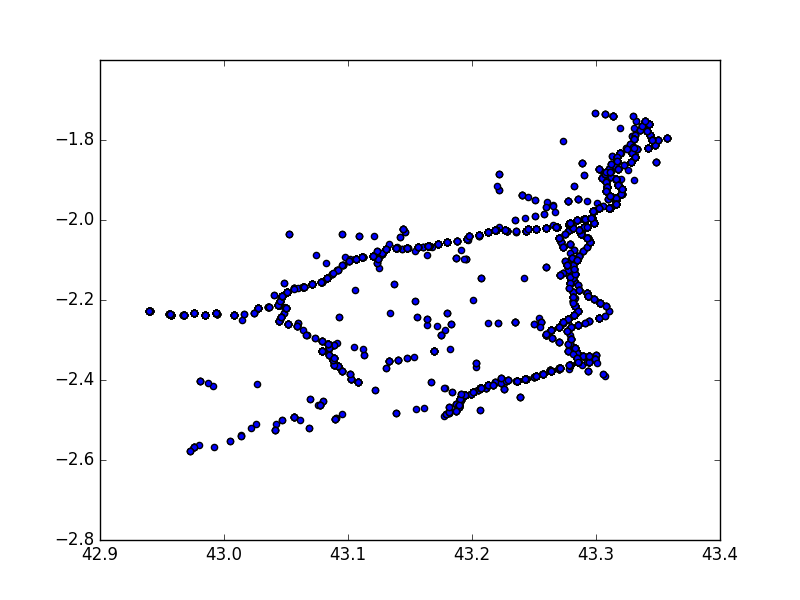

# Milestone 2

This milestone is aimed to to plot the accidents by its latitude and longitude and to cluster the obtained data by means of the DBSCAN algorithim trying to get an optiman Silhouette coefficient.

Aflter plotting with no clustering the data of the accidents of Gipuzkoa the following graph was obtained.

Then the distribution graph of the accidents was plotted in order to see the inflexion point.

It is thought to be close to *y* = 0.0075, which means that any cluster must have a minimun radio of 0.0075 and *n* elements within it. That *n* was set at 10, and after executing the DBSCAN algorithm with this data the following graph was generated.

It was obtained a total number of 158 clusters and a Silhouette coefficient of 0.702.
