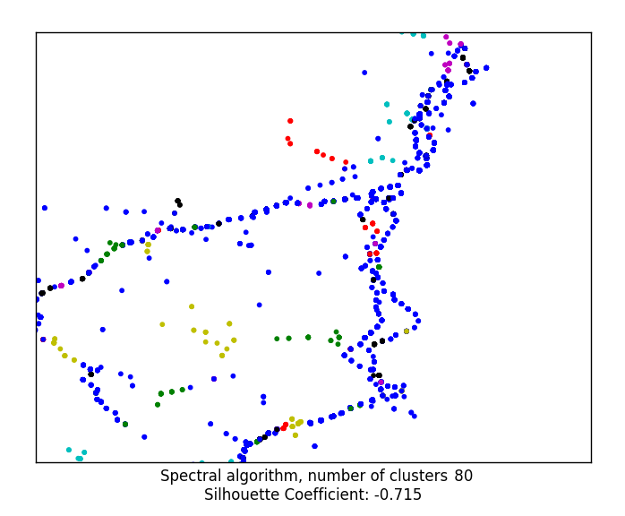

# Milestone 3

This milestone is devoted to calculate the number of clusters that optimizes the Silhouette coefficient and the distorsion of the data by means of the k-means algorithm.

The set of data we are working with consists on 7301 entries, which square root is ~85 so it was choose to execute the algorithm with the values *k* = {70, 80, 90, 100}. After executing the k-means algorithm the following graphs were generated.

 

Thus we found reasonable to determine the optiman number of cluster at *k* = 80.

So after executing the spectral algorithm with that *k* value the following graph was obtained.

