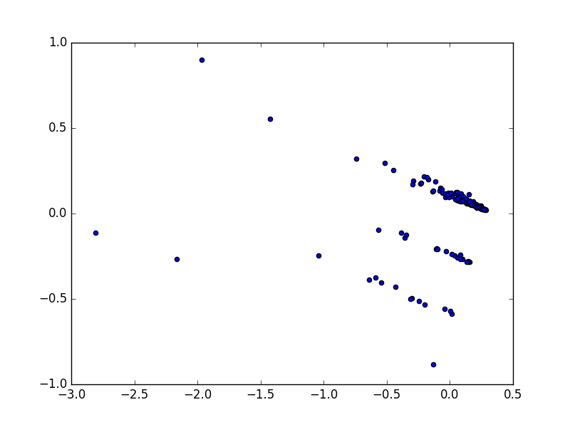
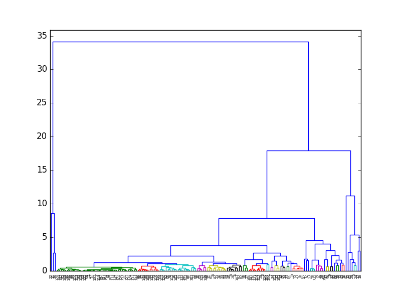

# Milestone 3

This milestone is devoted to calculate the zone each accident belongs to and a set of features for each zone.

* Number of accidents per reason
* Number of accidents per traffic level
* Number of accidents in winter (enero2006 - 21 marzo2006 && 22 diembre2006 - 31dic2006)
* Number of accidents in summer (20 junio - 23 septiembre)
* Number of accidents from 8.00am to 15.00pm
* Number of accidents from 15.00pm to 20.00pm
* Number of accidents from 20.00pm to 3.00am

Once those feaures were calculated, it was developed and executed the [PCA](https://en.wikipedia.org/wiki/Principal_component_analysis) algorithm. The unnormalized result was the following

Then it was decided to normalize the data obtaining the following result.

And the  [hierarchical](https://en.wikipedia.org/wiki/Hierarchical_clustering) algorithm. The resulting dendrogram was the following.

Then, a [CSV](out/inc2006acc_zone.csv) was obtaned showing the id of the cluster, the sumatory of each of its accidents and the mean of them.

Example of the CSV.

|Cluster|Number of accidents|Mean|
|-------|-------------------|----|
|1|762|806|
|1|1069| |
|1|762| |
|1|632| |
|2|216|196|
|2|244| |
|2|203| |
|...|...|...|
