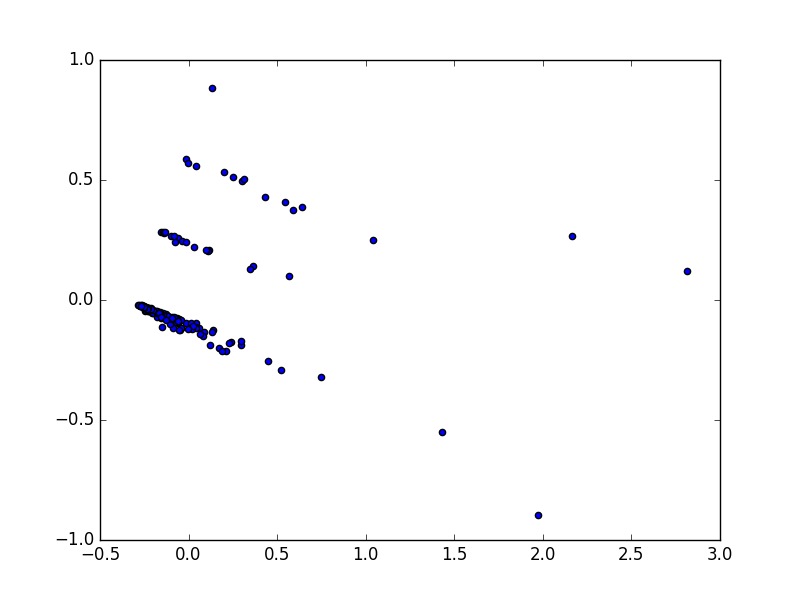

# Milestone 3

This milestone is devoted to calculate the zone each accident belongs to and a set of features for each zone.

* Number of accidents per reason
* Number of accidents per traffic level
* Number of accidents in winter (enero2006 - 21 marzo2006 && 22 diembre2006 - 31dic2006)
* Number of accidents in summer (20 junio - 23 septiembre)
* Number of accidents from 8.00am to 15.00pm
* Number of accidents from 15.00pm to 20.00pm
* Number of accidents from 20.00pm to 3.00am

Then develop and execute the [PCA](https://en.wikipedia.org/wiki/Principal_component_analysis) algorithm.

And the  [hierarchical](https://en.wikipedia.org/wiki/Hierarchical_clustering) algorithm.

