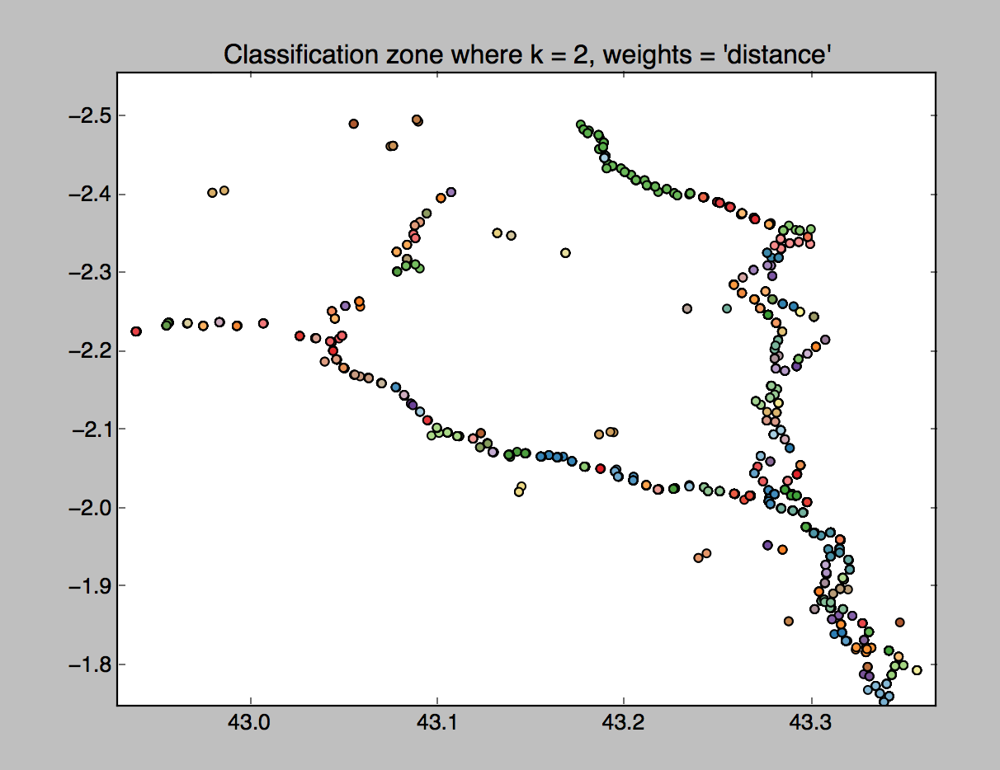

# Milestone 5

The first thing that was done was to normalise the data and to generate the files for training the algorithm with ~40% and ~60% of the data.

Once both files were randomly created, the algorithm was trained and it was obtained a K value of 2.

Then the color map were generated from it.

Then, the zones of the data were calculated and finnaly added to it on the [works_zones](out/works_zones.csv) file.
