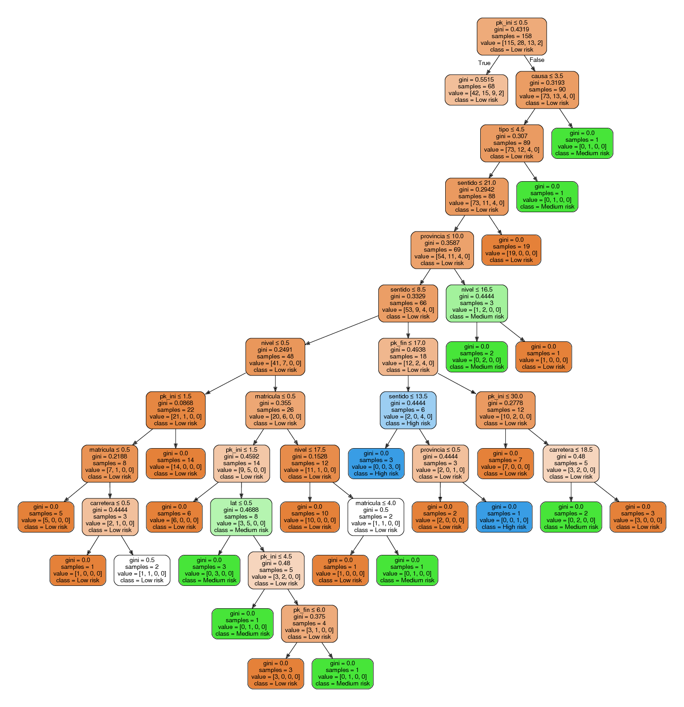

# Milestone 8 - Workroads analysis

Once the data of 2007 was set and ready for working with it it was choosen only the incidences related with works. Then a [KNN algorithm](src/knn.py) was trained with data of traffic accidents of 2006 and executed over the filtered data of 2006 in the hope of calculating the zones of those work incidences. Further information about KNN algorithm can be seen on [milestone 5](https://github.com/gomezportillo/machine_learning_project/tree/master/Milestone5%20-%20KNN).

After the zones of the data of 2007 were calculated, a set of [features were generated](src/generate_features.py).

* Number of accidents per traffic level
* Number of accidents in winter
* Number of accidents in summer
* Number of accidents from 8.00am to 15.00pm
* Number of accidents from 15.00pm to 20.00pm
* Number of accidents from 20.00pm to 3.00am

Then, after the features were calculated the [PCA algorithm](src/hierarchical.py) were executed in order to calculate the number of indicents on each cluster.

Finally, a [decision tree classifier algorithm](src/decision_tree.py) was executed for generating the following decision tree.

A [Makefile](Makefile) has been set for executing all the separated steps of this milestone. In case you aim to execute all the algorithms in order, please tipe *make full*.
